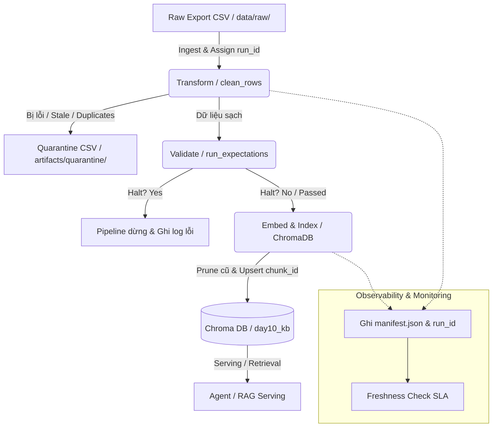

# Kiến trúc pipeline — Lab Day 10

**Học viên thực hiện:** Đặng Minh Chức  
**Lớp:** C401  
**Ngày nộp:** 2026-06-10  

---

## 1. Sơ đồ luồng (Pipeline Flow & Observability Points)

Dưới đây là sơ đồ luồng chi tiết bao gồm các điểm đo Freshness, ghi Run ID, cách ly Quarantine và lưu trữ Vector Store:

---

## 2. Ranh giới trách nhiệm

| Thành phần | Input | Output | Trách nhiệm chính / Owner |
|------------|-------|--------|--------------|
| **Ingest** | `data/raw/policy_export_dirty.csv` | List of dictionaries (dòng thô) | Trích xuất dữ liệu, định cấu hình đường dẫn đầu vào, gán `run_id` và ghi nhận số dòng thô (`raw_records`). |
| **Transform** | Dòng thô + Cấu hình data contract | Dòng sạch (`cleaned.csv`) + Dòng bị cách ly (`quarantine.csv`) | Thực thi các quy tắc làm sạch dữ liệu (loại bỏ khoảng trắng lặp, sửa lỗi chính tả, chuẩn hóa ngày hiệu lực, và lọc bỏ/sửa các chính sách cũ). |
| **Quality** | Dòng sạch từ Transform | Kết quả validation (Expectation Result) + quyết định Halt | Thực thi expectation suite (E1 đến E8) để ngăn chặn dữ liệu bẩn rò rỉ vào cơ sở dữ liệu vector. |
| **Embed** | Dòng sạch đã qua validation | Vector embeddings trong ChromaDB collection | Chuyển đổi văn bản thành vector bằng mô hình `all-MiniLM-L6-v2` và đồng bộ hóa (snapshot sync) vào ChromaDB. |
| **Monitor** | File manifest và log của run | Trạng thái Freshness (PASS/WARN/FAIL) + SLA Alert | Theo dõi thời gian cập nhật dữ liệu (`latest_exported_at`), đảm bảo dữ liệu luôn "tươi" trong phạm vi 24 giờ của SLA. |

---

## 3. Idempotency & rerun

Hệ thống đạt được tính **idempotent (nhất quán khi chạy lại)** nhờ vào các cơ chế sau:
- **Natural Chunk Key:** Khóa `chunk_id` được sinh ra ổn định dựa trên hàm hash SHA-256 từ nội dung văn bản và `doc_id` của tài liệu gốc (`_stable_chunk_id`). Rerun nhiều lần với cùng một dữ liệu sẽ tạo ra các `chunk_id` giống nhau.
- **Upsert Strategy:** Sử dụng lệnh `col.upsert()` của ChromaDB thay vì `col.add()`. Lệnh này ghi đè (update) nếu khóa đã tồn tại hoặc thêm mới (insert) nếu chưa có, tránh việc nhân bản tài nguyên.
- **Active Index Pruning:** Ở mỗi lượt chạy sạch, pipeline sẽ lấy tập hợp các khóa cũ trong bộ sưu tập Chroma và xóa bỏ các vector ID không còn xuất hiện trong tập dữ liệu sạch của phiên chạy hiện tại (`embed_prune_removed`). Điều này đảm bảo vector store phản ánh chính xác 100% snapshot dữ liệu hiện tại, loại bỏ hoàn toàn các "mồi cũ" bị stale.

---

## 4. Liên hệ Day 09

- Pipeline này đóng vai trò là tầng chuẩn bị dữ liệu (Data Preparation Layer). Nó làm sạch và đồng bộ dữ liệu thô từ các phòng ban vào cơ sở dữ liệu vector dùng chung (`day10_kb`).
- Khi các agent (Day 09) thực hiện truy vấn RAG, họ sẽ truy vấn trực tiếp vào bộ sưu tập `day10_kb` này. Do dữ liệu đã được lọc sạch phiên bản stale (ví dụ: hoàn tiền 14 ngày làm việc đã được chuẩn hóa về 7 ngày làm việc của v4), agent sẽ luôn truy xuất được thông tin đúng và trả lời chuẩn xác mà không cần thay đổi prompt hay fine-tune mô hình.

---

## 5. Rủi ro còn lại và biện pháp giảm thiểu

- **Xung đột Khóa Cơ sở dữ liệu (Database Lock):** Khi có nhiều tiến trình chạy pipeline dữ liệu hoặc chạy grading đồng thời, SQLite của ChromaDB có thể bị khóa, gây treo tiến trình. Biện pháp: Sử dụng cơ chế khóa phân tán hoặc kiểm tra tiến trình trước khi chạy.
- **Trôi Schema Dữ liệu (Schema Drift):** Cột trong CSV thô thay đổi hoặc thiếu. Biện pháp: Đồng bộ thông qua Data Contract (`data_contract.yaml`) và thiết lập các rule validation halt ở đầu pipeline.
- **Lệch phân phối dữ liệu (Data Skew):** Ingestion lỗi khiến một tài liệu bị thiếu toàn bộ dữ liệu. Biện pháp: Triển khai expectation `core_docs_present` (E7) để halt pipeline lập tức nếu thiếu bất cứ tài liệu cốt lõi nào.
